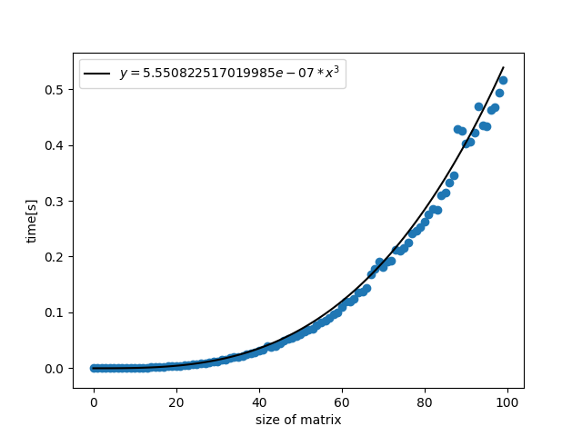

# 宿題１

実行結果：

考察：
行列積を求めるところが３重ループになっているので、計算量が O(N^3)になり、`y=a*x^3` の形のグラフになった。

疑問：
行列のサイズが大きくなるほど実行結果にばらつきが生じた理由

# 宿題２

大規模データベースで木構造が使われる理由

- ハッシュ関数を見積もるのが難しいから
  - 大きすぎると無駄なメモリが大きい
  - 小さすぎると組み換える必要が出てしまう
- 複数の条件を満たす検索をするのが難しいから
  - 例：生徒名と住所(都道府県)が入っている。東京都に住んでる鈴木さんを探したい。
  - 木構造だと、出席番号と生徒をノードに入れればいいだけ
  - ハッシュだと、テーブル２つ用意しなくてはいけない？

# 宿題 3

https://drive.google.com/file/d/1wxt3y0BM02rcBaF3qpaHPu69dyPuZ11X/view?usp=sharing
